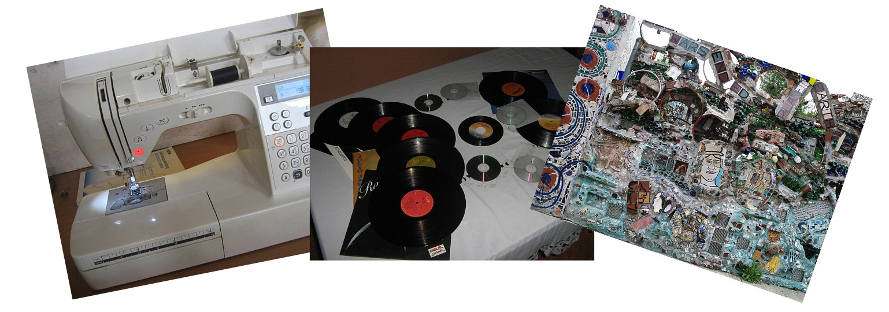

Beyond this course, I plan to continue exploring digital humanities and related topics:
1. I’ve always wanted to learn how to sew with a sewing machine. Although I briefly learned in middle school Home Economics, visiting the Education Commons reignited my desire to relearning this skill. With a lighter course load next semester, I hope to attend workshops to explore new textile techniques. It would be amazing to have this skill so that I can do simple tailoring to my clothing or thrift-finds. 
2. The cassette tapes from the Iffy Books workshop also sparked my curiosity about the process of creating and recording vinyl records. I’ve never fully understood how a piece of PVC with bumps produces music, so I’d love to research this further. I also plan to explore my dad’s vinyl collection, examining both the records and their sleeves in greater detail.
3. Lastly, I’m interested in visiting more non-traditional museums in Philadelphia, like our class trip to Eastern State Penitentiary. These spaces offer experiences that highlight history in more immersive ways; in exploring them I hope to connect with Philadelphia as I near graduation, while deepening  my understanding of how digital and physical tools can enhance historical preservation. Though I don’t believe it includes a digital component, I would love to visit Philadelphia’s Magic Garden in South Street. The unique mosaics there use symbolism and textures to tell a deeper story, much like the way digital archives or multimedia can layer meaning and context in art. Exploring such spaces will deepen my appreciation for how physical elements and digital tools can enhance storytelling through artistic expression.

  

