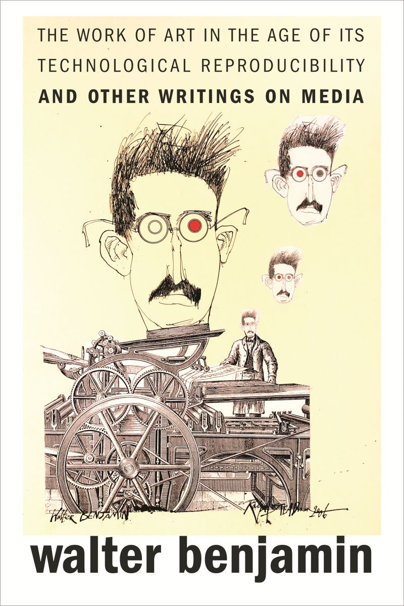

  As I reflect on my work and readings from the Introduction to Digital Humanities course, I’ve become increasingly aware of how the theme of aura relates to the reception of humanities materials in their digital versus physical forms. I was first introduced to the concept of aura during my sophomore year, when I read an excerpt from Walter Benjamin’s *The Work of Art in the Age of Mechanical Reproduction* in a class called Critical Approaches to Popular Culture. In his work, Benjamin asserts that mechanical reproduction changed how we perceive art. With the development of lithography, for example, the process of printing became much more efficient, meaning that art–whether written or pictorial–could be copied, printed, and disseminated at a much faster rate. An even more modern version of this phenomenon can be seen with cameras and smartphones. Before photography, people would go to museums to see artwork. Now, people photograph art and post it online for public viewing. With this, the experience of art has been extended, which Benjamin would argue decreases its authenticity. All of these aspects–distribution, authenticity, reproduction–relate closely to the aura–or “presence in time and space”–of the subject matter (3). In other words, art is stripped of its unique existence in a given space when it is digitized and reproduced for the masses, who want to bring art physically closer to them and into their phones, textbooks, and home decor. 
  

  

  A reading that closely relates to aura is Zachary Lesser and Whitney Trettien’s chapter “Material / digital” in the 2021 book *Shakespeare / Text: Contemporary Readings in Textual Studies, Editing, and Performance.* The authors are quick to acknowledge concerns similar to Benjamin’s regarding the digitization of art: “Many scholars have cautioned against treating digital images as surrogates for the original, citing the loss of texture, size, smell, colour and context” (402). The loss of materiality inherent in any work that was not initially digital is hard to deny. Stripping art from its original physicality represents the shedding of aura, creating distance between the artist or author and the viewer as the content becomes farther from its first form. On page 416, the authors suggest using metadata as a means to supplement some of what is lost through digitization. With more detailed information about digital objects, we can better see them as textual objects on their own. This concern about the loss of materiality in digitization echoes Benjamin’s argument about how mechanical reproduction diminishes the authenticity and presence of art. By using metadata to supplement digital objects, we can attempt to preserve some of the original context and aura that is lost when works are reproduced and distributed digitally.
  
  The Iffy Books Cassette Mixtape Session is another class material that forced me to confront the contrast between digital and physical forms. While digital music (like songs on Spotify) is widely accessible and can be reproduced infinitely, the cassette tape provides a unique, physical object that diminishes the ease of distribution while arguably strengthening one’s personal connection with the music. The act of transferring music to the cassette tape brought me closer to the melodies I often take for granted when I can listen to them anytime on my phone. Just as Benjamin argues that mechanical reproduction strips art of its authenticity, transferring music from Spotify to a cassette tape reintroduces a tangible, personal artifact, perhaps restoring some of the original flair of the music. On the other hand, while playing music from a cassette type feels more related to the artist’s process of recording and their studio time, the quality of the music from the tape reminded me that, unfortunately, the aura is still tainted in this second (or third) hand version of the music. Listening to music from a cassette brought me a sense of closeness to the artist’s recording process, yet the static, crackling quality of the tape reminded me that, like any reproduced art, the aura remains broken. The imperfections in the sound illustrate the difference between the clean-cut reproduction of a digital file and a physical form that may (or may not) better feign originality.

  

  These class experiences, along with others—such as our visit to the Kislak Center and SCETI—capture the push and pull between digital advancements and traditional textual humanities in our rapidly modernizing world. Coming into the class, I expected that we would be enveloped in the world of digital humanities, forgetting about its antiquated, tangible textual counterparts. I was completely incorrect in that assumption, and for that I am glad! Instead, Introduction to Digital Humanities has taught me to embrace the art and literature of the past, while ideally *enhancing* it with digital tools I was entirely unfamiliar with before the semester began. This class certainly reminded me of interest in preservation and archival work, offering a level of immersion I hadn’t anticipated. While I have taken archaeology classes and participated as a research assistant in archival research projects, I was excited to see a much larger scope of digital humanities. My pre-existing interest in this field meant that I was eager to ask questions and fully take in the content on our class trips. I loved working with Christine in the Education Commons, reading descriptions at Eastern State Penitentiary, asking questions at the workshops, and getting up close to the archives in the Kislak Center. That being said, my eye for preservation and materiality is balanced out by my reluctant relationship with Github and Markdown. I have never loved coding, and I struggled with website development in this class. I would have loved more time to improve my code for my multimedia essay and digital carousel, but with little technological know-how and an advanced idea, it was hard to bring my exact original design to life. 
